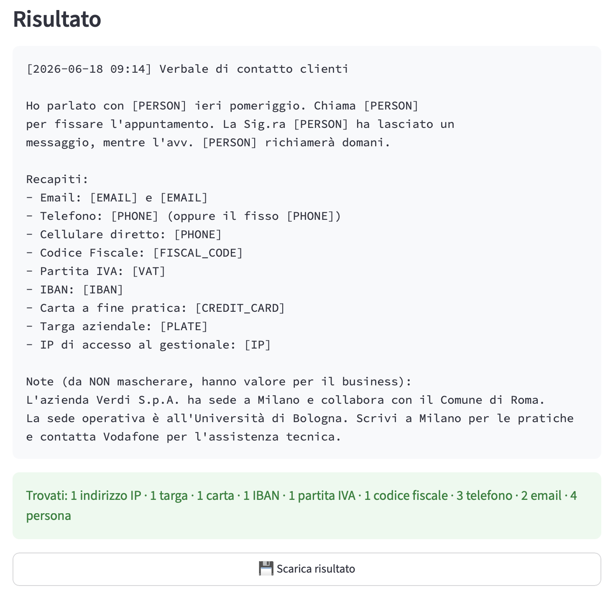

# PII Masker

🇮🇹 Anonimizzazione locale e multilingua dei dati personali (PII), costruita su
[Microsoft Presidio](https://microsoft.github.io/presidio/) con recognizer
italiani **validati tramite checksum**. Tutto gira on-premise: nessun dato lascia
mai la macchina.

🇬🇧 Local, multilingual anonymization of Personally Identifiable Information (PII),
built on [Microsoft Presidio](https://microsoft.github.io/presidio/) with custom
**checksum-validated** Italian recognizers. Everything runs on-premise — no data
ever leaves the machine.

**[🇮🇹 Versione italiana](#-italiano) · [🇬🇧 English version](#-english)**

---

## 🎬 Demo

Input — un verbale di esempio ([`esempio_prova.txt`](esempio_prova.txt)) con dati
personali **e** riferimenti aziendali/geografici da preservare:

```text
[2026-06-18 09:14] Verbale di contatto clienti
Ho parlato con Mario Rossi ieri pomeriggio. Chiama Anna Del Monte ...
- Email: mario.rossi@gmail.com
- Codice Fiscale: RSSMRA80A01H501U
- IBAN: IT60X0542811101000000123456
...
L'azienda Verdi S.p.A. ha sede a Milano e collabora con il Comune di Roma.
```

Output nella web-app — i dati personali sono mascherati, mentre città e aziende
restano intatte / personal data is masked, while cities and companies stay intact:



---

## 🇮🇹 Italiano

### Perché

Rilevare i PII con semplici espressioni regolari produce una valanga di falsi
positivi (qualsiasi stringa di 16 caratteri "sembra" un codice fiscale). Questo
strumento combina:

1. **Recognizer deterministici con validazione reale** — un Codice Fiscale viene
   mascherato solo se il suo *carattere di controllo* è corretto, una Partita IVA
   solo se la sua *cifra di controllo* torna, una carta di credito solo se passa
   *Luhn*. I sosia strutturali vengono lasciati intatti.
2. **NER (spaCy)** per i nomi, tramite l'analyzer di Presidio.
3. **Una regola di business voluta**: le persone vengono mascherate, ma **luoghi e
   organizzazioni vengono mantenuti**, per preservare il valore geografico e
   commerciale del dato.

### Cosa rileva

| Entità                | Placeholder      | Validazione                |
|-----------------------|------------------|----------------------------|
| Persona (NER)         | `[PERSON]`       | spaCy NER                  |
| Email                 | `[EMAIL]`        | regex                      |
| Telefono              | `[PHONE]`        | `phonenumbers`             |
| Carta di credito      | `[CREDIT_CARD]`  | Luhn                       |
| IBAN                  | `[IBAN]`         | controllo IBAN di Presidio |
| Indirizzo IP          | `[IP]`           | regex                      |
| Codice Fiscale (IT)   | `[FISCAL_CODE]`  | **carattere di controllo** |
| Partita IVA (IT)      | `[VAT]`          | **cifra di controllo**     |
| Targa veicolo (IT)    | `[PLATE]`        | formato (no checksum)      |

Lingue: **italiano** e **inglese** (modelli spaCy `it_core_news_lg` / `en_core_web_lg`).

### Installazione

```bash
conda create -n pii-masker python=3.11 -y
conda activate pii-masker
pip install -e .
python -m spacy download it_core_news_lg
python -m spacy download en_core_web_lg
```

### Interfaccia web (per utenti non tecnici)

App Streamlit locale: incolla il testo o trascina un file, premi un bottone, copia
o scarica il risultato mascherato. Gira su `localhost`, quindi nessun dato esce
dalla macchina.

```bash
pip install -e ".[gui]"   # installa streamlit
streamlit run app.py
```

Oppure **doppio click** su `avvia.command` (macOS) / `avvia.bat` (Windows): apre
l'app nel browser automaticamente.

### Riga di comando (CLI)

```bash
# Testo inline
pii-masker "Scrivi a mario.rossi@gmail.com"          # -> Scrivi a [EMAIL]

# Da file a file
pii-masker -f note.txt -o pulito.txt

# Da stdin
cat note.txt | pii-masker --lang it

# Inglese
pii-masker "Call John at john@acme.com" --lang en

# Mostra cosa è stato rilevato (JSON su stderr)
pii-masker -f note.txt --report

# Mascheramento reversibile per round-trip con un LLM (token unici + mappa)
pii-masker -f note.txt --reversible --map-out mappa.json
```

### Libreria

```python
from pii_masker import PIIMasker

masker = PIIMasker()                       # carica i modelli una volta; riutilizzalo
masker.mask("Scrivi a mario.rossi@gmail.com", language="it")
# 'Scrivi a [EMAIL]'

# Round-trip attraverso un LLM esterno e ritorno
r = masker.mask_reversible("Contatta Mario Rossi: mario@x.it")
r.text                                     # '<PERSON_0>: <EMAIL_ADDRESS_0>'
# ... invia r.text a un LLM, poi:
r.restore(risposta_llm)                    # ripristina i valori originali
```

### Aiuti al recall

- **I numeri di telefono italiani** sono rilevati con o senza prefisso
  internazionale (`+39 329 1234567` e il nudo `3291234567` funzionano entrambi).
- **I nomi che spaCy si perde** vengono recuperati dal contesto: un nome dopo un
  titolo ("Avv. Bianchi", "Sig.ra Rossi") o dopo un verbo di contatto
  ("Chiama Mario Rossi"). Per evitare falsi positivi, la regola sui verbi scatta
  solo su nome+cognome completo, così "Scrivi a Milano" / "Contatta Vodafone"
  restano intatti.

### Limiti noti

- **Il recall del NER non è perfetto.** Il rilevamento è best-effort, non una
  garanzia: trattalo come un filtro forte, non come un certificato di compliance.
- Un nome dopo un verbo, se persona reale ma scritto come singolo token (es. solo
  il nome di battesimo), può ancora sfuggire.
- Luoghi e organizzazioni **non** vengono mascherati di proposito.

### Test

```bash
pytest
```

La suite copre rilevamenti positivi, **controlli negativi** (luoghi e
organizzazioni devono restare intatti), validazione dei checksum (un codice
fiscale con carattere di controllo errato **non** viene mascherato), idempotenza,
reversibilità e le regressioni sugli span che attraversano gli a-capo.

---

## 🇬🇧 English

### Why

Detecting PII with plain regular expressions produces a flood of false positives
(any 16-character string "looks like" a fiscal code). This tool combines:

1. **Deterministic recognizers with real validation** — a Codice Fiscale is
   masked only if its *control character* is correct, a Partita IVA only if its
   *check digit* is correct, a credit card only if it passes *Luhn*. Structural
   lookalikes are left untouched.
2. **NER (spaCy)** for names, via Presidio's analyzer.
3. **A deliberate business rule**: people are masked, but **locations and
   organizations are kept**, so the geographic and commercial value of the data
   is preserved.

### What it detects

| Entity              | Placeholder      | Validation                |
|---------------------|------------------|---------------------------|
| Person (NER)        | `[PERSON]`       | spaCy NER                 |
| Email               | `[EMAIL]`        | regex                     |
| Phone               | `[PHONE]`        | `phonenumbers`            |
| Credit card         | `[CREDIT_CARD]`  | Luhn                      |
| IBAN                | `[IBAN]`         | Presidio IBAN check       |
| IP address          | `[IP]`           | regex                     |
| Codice Fiscale (IT) | `[FISCAL_CODE]`  | **control character**     |
| Partita IVA (IT)    | `[VAT]`          | **check digit**           |
| Vehicle plate (IT)  | `[PLATE]`        | format (no checksum)      |

Languages: **Italian** and **English** (spaCy `it_core_news_lg` / `en_core_web_lg`).

### Install

```bash
conda create -n pii-masker python=3.11 -y
conda activate pii-masker
pip install -e .
python -m spacy download it_core_news_lg
python -m spacy download en_core_web_lg
```

### Web UI (for non-technical users)

A local Streamlit app: paste text or drop a file, press one button, copy or
download the masked result. It runs on `localhost`, so no data leaves the machine.

```bash
pip install -e ".[gui]"   # installs streamlit
streamlit run app.py
```

Or just **double-click** `avvia.command` (macOS) / `avvia.bat` (Windows) — it
opens the app in the browser automatically.

### CLI

```bash
# Inline text
pii-masker "Scrivi a mario.rossi@gmail.com"          # -> Scrivi a [EMAIL]

# From a file, to a file
pii-masker -f notes.txt -o clean.txt

# From stdin
cat notes.txt | pii-masker --lang it

# English
pii-masker "Call John at john@acme.com" --lang en

# See what was detected (JSON on stderr)
pii-masker -f notes.txt --report

# Reversible masking for LLM round-trips (unique tokens + restore map)
pii-masker -f notes.txt --reversible --map-out map.json
```

### Library

```python
from pii_masker import PIIMasker

masker = PIIMasker()                       # loads the models once; reuse it
masker.mask("Scrivi a mario.rossi@gmail.com", language="it")
# 'Scrivi a [EMAIL]'

# Round-trip through an external LLM and back
r = masker.mask_reversible("Contatta Mario Rossi: mario@x.it")
r.text                                     # '<PERSON_0>: <EMAIL_ADDRESS_0>'
# ... send r.text to an LLM, then:
r.restore(llm_response)                    # originals reinserted
```

### Recall helpers

- **Italian phone numbers** are detected with or without an international prefix
  (`+39 329 1234567` and a bare `3291234567` both work).
- **Names spaCy misses** are recovered from context: a name after an honorific
  ("Avv. Bianchi", "Sig.ra Rossi") or after a communication verb
  ("Chiama Mario Rossi"). To avoid false positives, the verb rule only fires on a
  full first-plus-last name, so "Scrivi a Milano" / "Contatta Vodafone" stay intact.

### Known limitations

- **NER recall is not perfect.** Detection is best-effort, not a guarantee; treat
  the output as a strong filter, not a compliance certificate.
- A name after a verb that is a real person but written as a single token
  (e.g. only a first name) may still be missed.
- Locations/organizations are intentionally **not** masked.

### Testing

```bash
pytest
```

The suite covers positive detections, **negative controls** (locations and
organizations must stay intact), checksum validation (a fiscal code with a wrong
control character is *not* masked), idempotence, reversibility and the
newline span-conflict regressions.

---

## License

MIT.
